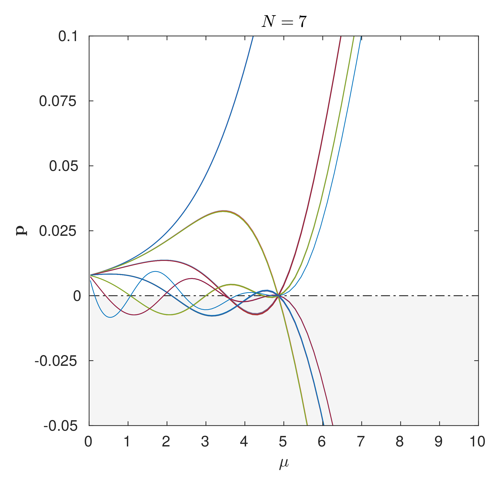

# Superstatistics
Code to reproduce "Combinatorial Superstatistics for Soft QCD" + beyond
<br>
https://arxiv.org/abs/1910.06279

[](https://opensource.org/licenses/MIT)



## Reference

If you use this work in your research, please cite the paper:
```
@article{mieskolainen2019combinatorial,
    title={Combinatorial Superstatistics for Soft QCD},
    author={Mikael Mieskolainen},
    year={2019},
    journal={arXiv:1910.06279},
    eprint={1910.06279},
    archivePrefix={arXiv},
    primaryClass={hep-ph}
}
```
